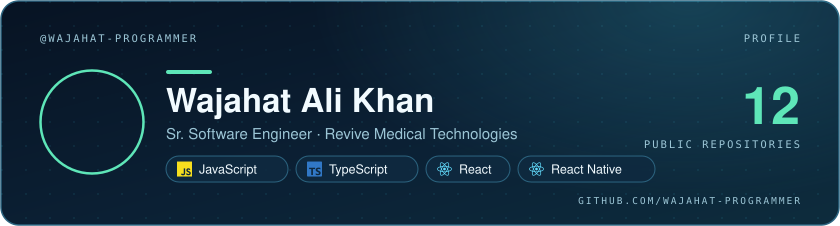
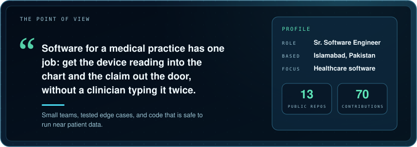
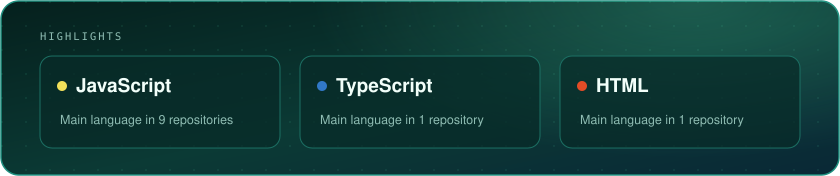
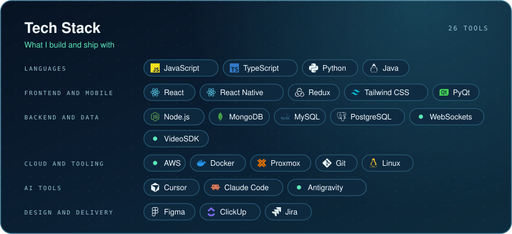
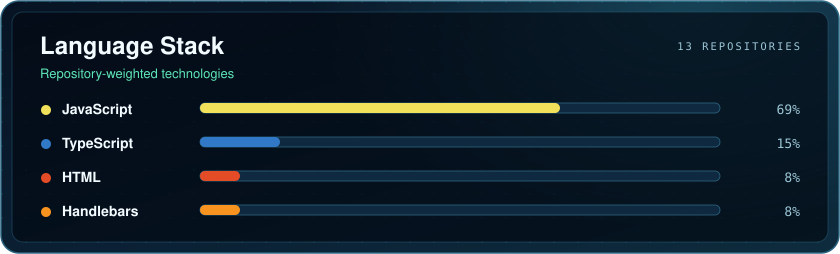
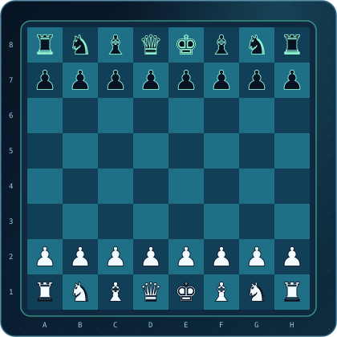

AN ORIGINAL PROFILE · WAJAHAT-PROGRAMMER

<b>Sr. Software Engineer</b> · Islamabad, Pakistan

RPM, EHR integration, RCM and AI software for medical practices.

<a href="https://www.linkedin.com/in/wak-swe/">LinkedIn</a> · <a href="mailto:wajahatalikhanundoscore@gmail.com">Email</a> · <a href="https://github.com/Wajahat-Programmer?tab=repositories">Repositories</a>

───── ◆ ─────

───── ◆ ─────

## In the current cut

The languages behind the most recent public work.

───── ◆ ─────

## Production palette

Tools chosen for the work, not the trend.

───── ◆ ─────

## Contribution trail

A snake eats the year, then a ship clears every active day. Both replay on a loop.

───── ◆ ─────

## Play the next move

<table>
  <tr>
    <td width="50%" align="center"> REPLAY · The Opera Game, Paris 1858. Plays by itself.</td>
    <td width="50%" align="center"> LIVE BOARD · Black to move. Pick your move from the list below.</td>
  </tr>
</table>

### Choose your move

<b>Black to move.</b> Anyone with a GitHub account can play. A README cannot run a game, so pieces cannot be dragged: each move below is a link.

1. Click a move in the table below. 2. On the page that opens, press the green <b>Create</b> button without changing anything. 3. Come back in about a minute and refresh: the board has moved.

| Piece | From | Move to |
| --- | --- | --- |
| Pawn | b6 | <a href="https://github.com/Wajahat-Programmer/Wajahat-Programmer/issues/new?title=chess%7Cmove%7Cb6b5&amp;body=Press+the+green+Create+button+to+play+this+move.+No+need+to+change+anything+here.">b5</a> |
| Pawn | a7 | <a href="https://github.com/Wajahat-Programmer/Wajahat-Programmer/issues/new?title=chess%7Cmove%7Ca7a5&amp;body=Press+the+green+Create+button+to+play+this+move.+No+need+to+change+anything+here.">a5</a> · <a href="https://github.com/Wajahat-Programmer/Wajahat-Programmer/issues/new?title=chess%7Cmove%7Ca7a6&amp;body=Press+the+green+Create+button+to+play+this+move.+No+need+to+change+anything+here.">a6</a> |
| Pawn | c7 | <a href="https://github.com/Wajahat-Programmer/Wajahat-Programmer/issues/new?title=chess%7Cmove%7Cc7c5&amp;body=Press+the+green+Create+button+to+play+this+move.+No+need+to+change+anything+here.">c5</a> · <a href="https://github.com/Wajahat-Programmer/Wajahat-Programmer/issues/new?title=chess%7Cmove%7Cc7c6&amp;body=Press+the+green+Create+button+to+play+this+move.+No+need+to+change+anything+here.">c6</a> |
| Pawn | d7 | <a href="https://github.com/Wajahat-Programmer/Wajahat-Programmer/issues/new?title=chess%7Cmove%7Cd7d5&amp;body=Press+the+green+Create+button+to+play+this+move.+No+need+to+change+anything+here.">d5</a> · <a href="https://github.com/Wajahat-Programmer/Wajahat-Programmer/issues/new?title=chess%7Cmove%7Cd7d6&amp;body=Press+the+green+Create+button+to+play+this+move.+No+need+to+change+anything+here.">d6</a> |
| Pawn | e7 | <a href="https://github.com/Wajahat-Programmer/Wajahat-Programmer/issues/new?title=chess%7Cmove%7Ce7e5&amp;body=Press+the+green+Create+button+to+play+this+move.+No+need+to+change+anything+here.">e5</a> · <a href="https://github.com/Wajahat-Programmer/Wajahat-Programmer/issues/new?title=chess%7Cmove%7Ce7e6&amp;body=Press+the+green+Create+button+to+play+this+move.+No+need+to+change+anything+here.">e6</a> |
| Pawn | f7 | <a href="https://github.com/Wajahat-Programmer/Wajahat-Programmer/issues/new?title=chess%7Cmove%7Cf7f5&amp;body=Press+the+green+Create+button+to+play+this+move.+No+need+to+change+anything+here.">f5</a> · <a href="https://github.com/Wajahat-Programmer/Wajahat-Programmer/issues/new?title=chess%7Cmove%7Cf7f6&amp;body=Press+the+green+Create+button+to+play+this+move.+No+need+to+change+anything+here.">f6</a> |
| Pawn | g7 | <a href="https://github.com/Wajahat-Programmer/Wajahat-Programmer/issues/new?title=chess%7Cmove%7Cg7g5&amp;body=Press+the+green+Create+button+to+play+this+move.+No+need+to+change+anything+here.">g5</a> · <a href="https://github.com/Wajahat-Programmer/Wajahat-Programmer/issues/new?title=chess%7Cmove%7Cg7g6&amp;body=Press+the+green+Create+button+to+play+this+move.+No+need+to+change+anything+here.">g6</a> |
| Pawn | h7 | <a href="https://github.com/Wajahat-Programmer/Wajahat-Programmer/issues/new?title=chess%7Cmove%7Ch7h5&amp;body=Press+the+green+Create+button+to+play+this+move.+No+need+to+change+anything+here.">h5</a> · <a href="https://github.com/Wajahat-Programmer/Wajahat-Programmer/issues/new?title=chess%7Cmove%7Ch7h6&amp;body=Press+the+green+Create+button+to+play+this+move.+No+need+to+change+anything+here.">h6</a> |
| Knight | b8 | <a href="https://github.com/Wajahat-Programmer/Wajahat-Programmer/issues/new?title=chess%7Cmove%7Cb8a6&amp;body=Press+the+green+Create+button+to+play+this+move.+No+need+to+change+anything+here.">Na6</a> · <a href="https://github.com/Wajahat-Programmer/Wajahat-Programmer/issues/new?title=chess%7Cmove%7Cb8c6&amp;body=Press+the+green+Create+button+to+play+this+move.+No+need+to+change+anything+here.">Nc6</a> |
| Bishop | c8 | <a href="https://github.com/Wajahat-Programmer/Wajahat-Programmer/issues/new?title=chess%7Cmove%7Cc8a6&amp;body=Press+the+green+Create+button+to+play+this+move.+No+need+to+change+anything+here.">Ba6</a> · <a href="https://github.com/Wajahat-Programmer/Wajahat-Programmer/issues/new?title=chess%7Cmove%7Cc8b7&amp;body=Press+the+green+Create+button+to+play+this+move.+No+need+to+change+anything+here.">Bb7</a> |
| Knight | g8 | <a href="https://github.com/Wajahat-Programmer/Wajahat-Programmer/issues/new?title=chess%7Cmove%7Cg8f6&amp;body=Press+the+green+Create+button+to+play+this+move.+No+need+to+change+anything+here.">Nf6</a> · <a href="https://github.com/Wajahat-Programmer/Wajahat-Programmer/issues/new?title=chess%7Cmove%7Cg8h6&amp;body=Press+the+green+Create+button+to+play+this+move.+No+need+to+change+anything+here.">Nh6</a> |

Recent moves: 1. e4 (<a href="https://github.com/Wajahat-Programmer">Wajahat-Programmer</a>) · 1... b6 (<a href="https://github.com/hussainahmad2">hussainahmad2</a>) · 2. Nc3 (<a href="https://github.com/Wajahat-Programmer">Wajahat-Programmer</a>)

───── ◆ ─────

THE NEXT SCENE

<h2 align="center">Keep the story moving</h2>

I enjoy working with people who care about the details, share the context, and ship something useful.

<a href="https://www.linkedin.com/in/wak-swe/">LinkedIn</a> · <a href="mailto:wajahatalikhanundoscore@gmail.com">Email</a>

