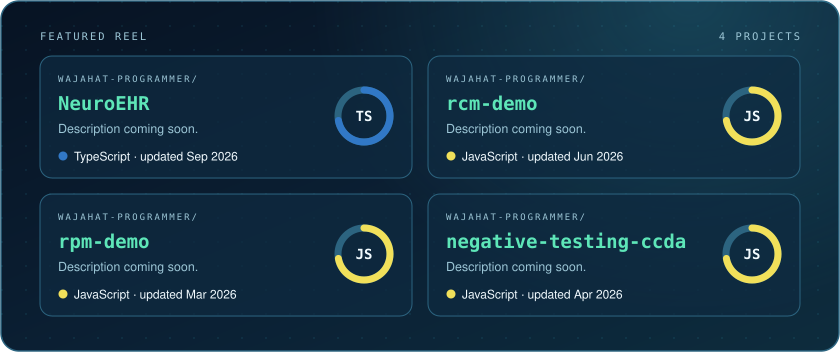

AN ORIGINAL PROFILE · WAJAHAT-PROGRAMMER

<b>Head of Software Division</b> · Islamabad, Pakistan

RPM, EHR integration, RCM and AI software for medical practices.

<a href="https://www.linkedin.com/in/wak-swe/">LinkedIn</a> · <a href="mailto:wajahatalikhanundoscore@gmail.com">Email</a> · <a href="https://github.com/Wajahat-Programmer?tab=repositories">Repositories</a>

───── ◆ ─────

<table>
  <tr>
    <td width="62%" valign="top">
      <h2>The point of view</h2>
      <blockquote>Software for a medical practice has one job: get the device reading into the chart and the claim out the door, without a clinician typing it twice.</blockquote>
      Small teams, tested edge cases, and code that is safe to run near patient data.
    </td>
    <td width="38%" valign="top">
      <b>PROFILE</b>  
      ROLE · Head of Software Division 
      BASED · Islamabad, Pakistan 
      FOCUS · Healthcare software 
      STACK · React, React Native, Node.js, TypeScript, AWS  
      <b>12</b> public repositories 
      <b>58</b> contributions in the last year
    </td>
  </tr>
</table>

───── ◆ ─────

## In the current cut

The languages behind the most recent public work.

───── ◆ ─────

## Production palette

Tools chosen for the work, not the trend.

───── ◆ ─────

## Featured reel

<table>
  <tr>
    <td width="25%" valign="top"><a href="https://github.com/Wajahat-Programmer/NeuroEHR"><b>NeuroEHR</b></a>  Description coming soon.  TypeScript</td>
    <td width="25%" valign="top"><a href="https://github.com/Wajahat-Programmer/rcm-demo"><b>rcm-demo</b></a>  Description coming soon.  JavaScript</td>
    <td width="25%" valign="top"><a href="https://github.com/Wajahat-Programmer/rpm-demo"><b>rpm-demo</b></a>  Description coming soon.  JavaScript</td>
    <td width="25%" valign="top"><a href="https://github.com/Wajahat-Programmer/negative-testing-ccda"><b>negative-testing-ccda</b></a>  Description coming soon.  JavaScript</td>
  </tr>
</table>

───── ◆ ─────

## Contribution trail

───── ◆ ─────

## Play the next move

<b>White to move.</b> Anyone can play. Pick a move below, press "Submit new issue", and the board updates in about a minute.

| Piece | From | Move to |
| --- | --- | --- |
| Knight | b1 | <a href="https://github.com/Wajahat-Programmer/Wajahat-Programmer/issues/new?title=chess%7Cmove%7Cb1a3&amp;body=Press+%22Submit+new+issue%22+to+play.+No+need+to+change+anything+here.">Na3</a> · <a href="https://github.com/Wajahat-Programmer/Wajahat-Programmer/issues/new?title=chess%7Cmove%7Cb1c3&amp;body=Press+%22Submit+new+issue%22+to+play.+No+need+to+change+anything+here.">Nc3</a> |
| Knight | g1 | <a href="https://github.com/Wajahat-Programmer/Wajahat-Programmer/issues/new?title=chess%7Cmove%7Cg1f3&amp;body=Press+%22Submit+new+issue%22+to+play.+No+need+to+change+anything+here.">Nf3</a> · <a href="https://github.com/Wajahat-Programmer/Wajahat-Programmer/issues/new?title=chess%7Cmove%7Cg1h3&amp;body=Press+%22Submit+new+issue%22+to+play.+No+need+to+change+anything+here.">Nh3</a> |
| Pawn | a2 | <a href="https://github.com/Wajahat-Programmer/Wajahat-Programmer/issues/new?title=chess%7Cmove%7Ca2a3&amp;body=Press+%22Submit+new+issue%22+to+play.+No+need+to+change+anything+here.">a3</a> · <a href="https://github.com/Wajahat-Programmer/Wajahat-Programmer/issues/new?title=chess%7Cmove%7Ca2a4&amp;body=Press+%22Submit+new+issue%22+to+play.+No+need+to+change+anything+here.">a4</a> |
| Pawn | b2 | <a href="https://github.com/Wajahat-Programmer/Wajahat-Programmer/issues/new?title=chess%7Cmove%7Cb2b3&amp;body=Press+%22Submit+new+issue%22+to+play.+No+need+to+change+anything+here.">b3</a> · <a href="https://github.com/Wajahat-Programmer/Wajahat-Programmer/issues/new?title=chess%7Cmove%7Cb2b4&amp;body=Press+%22Submit+new+issue%22+to+play.+No+need+to+change+anything+here.">b4</a> |
| Pawn | c2 | <a href="https://github.com/Wajahat-Programmer/Wajahat-Programmer/issues/new?title=chess%7Cmove%7Cc2c3&amp;body=Press+%22Submit+new+issue%22+to+play.+No+need+to+change+anything+here.">c3</a> · <a href="https://github.com/Wajahat-Programmer/Wajahat-Programmer/issues/new?title=chess%7Cmove%7Cc2c4&amp;body=Press+%22Submit+new+issue%22+to+play.+No+need+to+change+anything+here.">c4</a> |
| Pawn | d2 | <a href="https://github.com/Wajahat-Programmer/Wajahat-Programmer/issues/new?title=chess%7Cmove%7Cd2d3&amp;body=Press+%22Submit+new+issue%22+to+play.+No+need+to+change+anything+here.">d3</a> · <a href="https://github.com/Wajahat-Programmer/Wajahat-Programmer/issues/new?title=chess%7Cmove%7Cd2d4&amp;body=Press+%22Submit+new+issue%22+to+play.+No+need+to+change+anything+here.">d4</a> |
| Pawn | e2 | <a href="https://github.com/Wajahat-Programmer/Wajahat-Programmer/issues/new?title=chess%7Cmove%7Ce2e3&amp;body=Press+%22Submit+new+issue%22+to+play.+No+need+to+change+anything+here.">e3</a> · <a href="https://github.com/Wajahat-Programmer/Wajahat-Programmer/issues/new?title=chess%7Cmove%7Ce2e4&amp;body=Press+%22Submit+new+issue%22+to+play.+No+need+to+change+anything+here.">e4</a> |
| Pawn | f2 | <a href="https://github.com/Wajahat-Programmer/Wajahat-Programmer/issues/new?title=chess%7Cmove%7Cf2f3&amp;body=Press+%22Submit+new+issue%22+to+play.+No+need+to+change+anything+here.">f3</a> · <a href="https://github.com/Wajahat-Programmer/Wajahat-Programmer/issues/new?title=chess%7Cmove%7Cf2f4&amp;body=Press+%22Submit+new+issue%22+to+play.+No+need+to+change+anything+here.">f4</a> |
| Pawn | g2 | <a href="https://github.com/Wajahat-Programmer/Wajahat-Programmer/issues/new?title=chess%7Cmove%7Cg2g3&amp;body=Press+%22Submit+new+issue%22+to+play.+No+need+to+change+anything+here.">g3</a> · <a href="https://github.com/Wajahat-Programmer/Wajahat-Programmer/issues/new?title=chess%7Cmove%7Cg2g4&amp;body=Press+%22Submit+new+issue%22+to+play.+No+need+to+change+anything+here.">g4</a> |
| Pawn | h2 | <a href="https://github.com/Wajahat-Programmer/Wajahat-Programmer/issues/new?title=chess%7Cmove%7Ch2h3&amp;body=Press+%22Submit+new+issue%22+to+play.+No+need+to+change+anything+here.">h3</a> · <a href="https://github.com/Wajahat-Programmer/Wajahat-Programmer/issues/new?title=chess%7Cmove%7Ch2h4&amp;body=Press+%22Submit+new+issue%22+to+play.+No+need+to+change+anything+here.">h4</a> |

───── ◆ ─────

THE NEXT SCENE

<h2 align="center">Keep the story moving</h2>

I enjoy working with people who care about the details, share the context, and ship something useful.

<a href="https://www.linkedin.com/in/wak-swe/">LinkedIn</a> · <a href="mailto:wajahatalikhanundoscore@gmail.com">Email</a>

